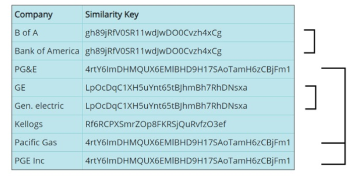

# Node-Examples

These are code examples showing how to call and utilize Interzoid's various Cloud APIs using Go. Interzoid's APIs provide real-time data in several categories for integration into Web sites, applications, and business processes. There are also data matching and data validation APIs that can significantly improve the value of your data assets.

**GetCompanyMatchSimkey.js** - generates a similarity key to use to match/locate other similar company names ("IBM" & "International Business Machines", etc.) - visit the API Page: https://www.interzoid.com/services/getcompanymatchadvanced  

